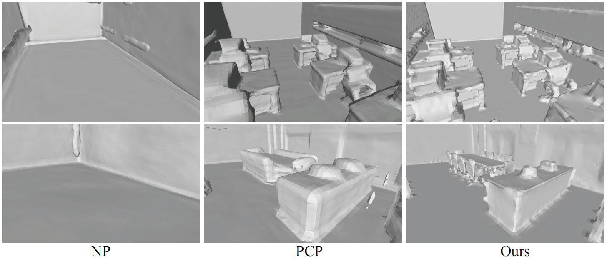

  <h1 align="center">GridPull: Towards Scalability in Learning Implicit Representations from 3D Point Clouds</h1>
  

    <a href="https://chenchao15.github.io/"><strong>Chao Chen</strong></a>
    ·
    <a href="https://yushen-liu.github.io/"><strong>Yu-Shen Liu</strong></a>
    ·
    <a href="https://h312h.github.io/"><strong>Zhizhong Han</strong></a>

  

  <h2 align="center">ICCV 2023</h2>
  <h3 align="center"><a href="https://arxiv.org/pdf/2308.13175.pdf">Paper</a> | <a href="https://chenchao15.github.io/GridPull">Project Page</a></h3>
  

## Citation

If you find our code or paper useful, please consider citing

    @inproceedings{chao2023gridpull,
        title = {GridPull: Towards Scalability in Learning Implicit Representations from 3D Point Clouds},
        author = {Chao Chen and Yu-Shen Liu and Zhizhong Han},
        booktitle = {Proceedings of the IEEE International Conference on Computer Vision (ICCV)},
        year = {2023}
    }

## Overview

  

We propose GridPull to speed up the learning of implicit function from large scale point clouds. GridPull does not require learned priors or point normal, and directly infers a distance field from a point cloud without using any neural components. We infer the distance field on grids near the surface, which reduces the number of grids we need to infer. Our loss function encourages continuous distances and consistent gradients in the field, which makes up the lack of continuousness brought by neural networks.

## Demo Results
### ShapeNet

  

### FAMOUS

  

### SRB

  

### SceneNet

  

### SceneNet

  

### 3DFront

  

### mattport3d

  

## Installation

Coming soon

## Dataset
## Train
## Test
